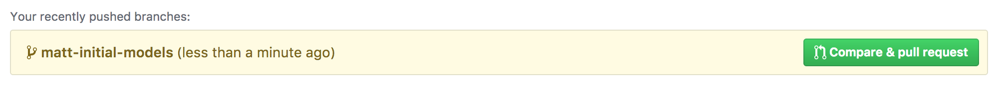
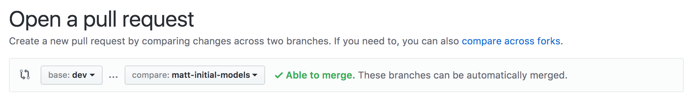

# Introduction

This repository contains the back end source code for team 'job-bilby' for the University of Melbourne subject SWEN90014 Masters Software Engineering Project. The project is a mobile-first web application for sharing tasks. The back-end is based on the REST Framework for Django.
Client: Paul Ashkar (Capgemini)                 paul.ashkar@capgemini.com
Supervisor: Rachel Burrows                      rachel.burrows@unimelb.edu.au
Team:
Annie Zhou:                                     azhou@student.unimelb.edu.au
David Barrell:                                   dbarrell@student.unimelb.edu.au
Grace Johnson:                                  gjohnson1@student.unimelb.edu.au
Hugh Edwards:                                   hughe@student.unimelb.edu.au
Matt Perrot:                                    mperrott@student.unimelb.edu.au 
View our 'Project Overview' document on Confluence for more information about the project.
Date project started: 6/8/2017
Date project completed: 15/10/2017

This document contains the setup information for the back-end.


# Setup

### Prereqs

Ensure python 3.6 is installed (check using `python3 -V`).

Install `easy_install`.

Install `pip`.

### Setup Database

Install [**Postgres**](https://www.postgresql.org/):

* [**Linux**](http://postgresguide.com/setup/install.html)
* [**MacOS**](https://www.moncefbelyamani.com/how-to-install-postgresql-on-a-mac-with-homebrew-and-lunchy/)

Set up Postgres User and DB

**Linux** (*haven't tested, please update instructions if they're wrong*)

1. Assign yourself as a super user for PostgreSQL
   `sudo su - postgres` to change to the postgres user
2. Create a new user with the same name as your login and assign it super user
   status `createuser <username> -s --no-password`
3. Exit out (`exit`) and perform the rest of the commands from your user
4. Create a new db user for the app
   `createuser job_user --no-password --createdb`
5. Create a new db and add the user as the owner
   `createdb job_db --owner=job_user`

**MacOS**

1. Launch postgres shell with `psql postgres`
2. Create a database user
   `CREATE ROLE job_user WITH CREATEDB LOGIN PASSWORD 'bilby';`
3. Create the database
   `CREATE DATABASE job_db WITH OWNER=job_user;`

### Setup Virtual Environment (venv)

VirtualEnv is a way to create isolated Python environments for every project and VirtualEnvWrapper "wraps" the virtualenv API to make it more user friendly.

```
pip install pip --upgrade
pip install virtualenv
pip install virtualenvwrapper
```

To complete the virtualenv setup process, put the following in you ~/.bash_profile

```
export WORKON_HOME=$HOME/.virtualenvs
source /usr/local/bin/virtualenvwrapper.sh
```

### Create virtual environment

Run the following in the root folder of the cloned repo:

```
mkvirtualenv job-bilby --python=python3
workon job-bilby
pip install pip --upgrade
pip install -r requirements.txt
```

To deactivate the virtual environment, use `deactivate`.

### Adding the required environmental variables

For local development, the following environmental variables are required:
 - DJANGO_SECRET_KEY
 - DB_NAME
 - DB_USERNAME
 - DB_PASSWORD

The recommended way of having these set is via the `postactivate` shell script that is executed whenever a virtualenv is activated.

Presuming you're using virtualenvwrapper and have named your virtualenv `job-bilby`, edit the file at `~/.virtualenvs/job-bilby/bin/postactivate` and add the following:  

    export DJANGO_ENV='dev'
    export DJANGO_DEBUG='True'
    export DJANGO_SECRET_KEY=')61qil2+l+j7*xz3!mr1w44(x&3xe+bsx4^bi^4h(tu8yn&8(h'
    export DB_NAME='job_db'
    export DB_USERNAME='job_user'
    export DB_PASSWORD='bilby'

### Migrate Database

```
python manage.py makemigrations
python manage.py migrate
```

### Workflow

Main branches:

* Development &rarr; `dev`
* Production &rarr; `master`

Both `dev` and `master` will be set up to auto-deploy to different Heroku
instances. Production (`master`) is what we will share with the client, so only
merge into master when we're getting ready to share with the client.

For general development work on your own branch and submit a pull request to
`dev`:



Merge your branch into `dev` with the pull request:



A good naming structure for your own branch might be `<name>-<feature>`.

**NOTE**

* Remember to activate your venv
* Remember to run `pip install -r requirements.txt` each time you start work,
  especially at the start. We might be adding new packages to the venv as we go
* If you `pip install` something, make sure you `pip freeze > requirements.txt`
  and commit your changes, so everyone has the same environment

## Deployment
### Staging
Each push to the `dev` branch will be automatically compiled and push to Heroku.
It can be accessed at [https://job-bilby-dev.herokuapp.com/](https://job-bilby-dev.herokuapp.com/).

### Production
Each push to the `master` branch will be automatically compiled and push to Heroku.
It can be accessed at [https://job-bilby.herokuapp.com/](https://job-bilby.herokuapp.com/).

### Logging
This backend utilises Papertrail for logging purposes. Once the Heroku CLI is installed and you have logged in,
logs can be accessed with `heroku addons:open papertrail --app=job-bilby(-dev)`.


## Testing

The test suite can be run with the following command:

`./manage.py test`

  **TODO**

- [ ] Add fixtures to load testing data locally
- [ ] Write some basic tests
- [ ] Everything else
